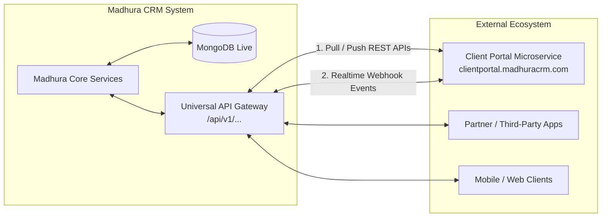
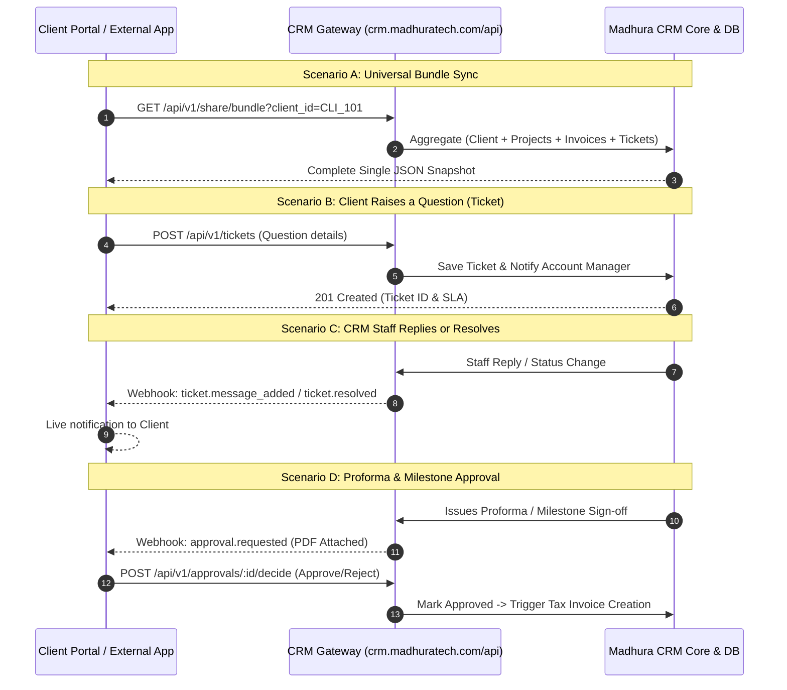

# Madhura CRM: Universal Two-Way API & Data Sharing Specification

> **Live System Domain:** `https://crm.madhuratech.com`  
> **API Gateway Base URL:** `https://crm.madhuratech.com/api`  
> **Purpose:** Single Universal API Gateway enabling bidirectional sharing, creation, updates, and synchronization for **Clients, Questions (Tickets), Projects, and Proforma/Tax Invoices** across microservices.

---

## 1. System Architecture & Two-Way Interaction Model

The Universal API acts as an intelligent bridge connecting the **Madhura CRM backend** with external applications (Client Portal, Partner Apps, Mobile Clients).

### 1.1 High-Level Architecture Diagram



---

### 1.2 Two-Way Interaction Lifecycle

Every entity supports a bidirectional **Share $\leftrightarrow$ Create/Edit $\leftrightarrow$ Reconcile** lifecycle:



---

## 2. Universal Bundle Endpoint (Single API for Everything)

Instead of making 5 separate network calls, external microservices can fetch an **all-in-one dynamic bundle** for any client in a single round-trip.

### `GET https://crm.madhuratech.com/api/v1/share/bundle`

* **Method:** `GET`
* **Query Parameters:**
  * `client_id` (required): Client ObjectId or Code (e.g. `664fa1b209e5b2001a123456`)
  * `include` (optional): Comma-separated entities: `profile,projects,invoices,proformas,tickets,milestones`
* **Headers:**
  ```http
  X-API-Key: crm_live_9981abc123
  Content-Type: application/json
  ```
* **Sample Request (cURL):**
  ```bash
  curl -X GET "https://crm.madhuratech.com/api/v1/share/bundle?client_id=664fa1b209e5b2001a123456" \
    -H "X-API-Key: crm_live_9981abc123" \
    -H "Content-Type: application/json"
  ```
* **Sample JSON Response:**
  ```json
  {
    "success": true,
    "timestamp": "2026-09-26T10:00:00.000Z",
    "data": {
      "client": {
        "id": "664fa1b209e5b2001a123456",
        "name": "Acme Technologies Private Limited",
        "tier": "ENTERPRISE",
        "gstin": "33AAAAA0000A1Z5",
        "billing_email": "accounts@acme.com",
        "primary_contact": {
          "name": "Ravi Kumar",
          "phone": "+919876543210",
          "email": "ravi@acme.com"
        }
      },
      "projects": [
        {
          "id": "664fa3c309e5b2001a789012",
          "name": "ERP Modernization",
          "code": "PRJ-2026-004",
          "status": "ACTIVE",
          "progress": 65,
          "milestones_pending": 1,
          "milestones_completed": 3
        }
      ],
      "proforma_invoices": [
        {
          "id": "prof_9901",
          "invoice_no": "PI-2026-0089",
          "amount": 250000,
          "status": "PENDING_APPROVAL",
          "date": "2026-09-20T00:00:00.000Z"
        }
      ],
      "tax_invoices": [
        {
          "id": "664fa4e509e5b2001a345678",
          "invoice_no": "INV-2026-0142",
          "total_amount": 118000,
          "balance_due": 59000,
          "status": "PARTIALLY_PAID",
          "pdf_url": "https://crm.madhuratech.com/api/v1/invoices/664fa4e509e5b2001a345678/pdf"
        }
      ],
      "questions_tickets": [
        {
          "id": "tkt_7781",
          "code": "TCK-1042",
          "title": "Need Tax Clearance Certificate",
          "status": "OPEN",
          "last_activity": "2026-09-26T09:30:00.000Z"
        }
      ]
    }
  }
  ```

---

## 3. Entity-by-Entity Two-Way Sharing APIs

All endpoints run on the live gateway: `https://crm.madhuratech.com/api/v1`

---

### 3.1 Clients (Share, Create, and Edit)

| Operation | Method & URI | Purpose |
| :--- | :--- | :--- |
| **Share (Read)** | `GET https://crm.madhuratech.com/api/v1/clients/:id` | Reads client profile and assigned manager |
| **Create** | `POST https://crm.madhuratech.com/api/v1/clients` | Portal or sales app onboards new client |
| **Edit (Update)**| `PUT https://crm.madhuratech.com/api/v1/clients/:id` | Direct updates to address, phone, contact details |
| **Request Edit** | `POST https://crm.madhuratech.com/api/v1/clients/:id/change-requests` | Client submits change request for staff review |

#### Sample Create Client Request:
* **`POST https://crm.madhuratech.com/api/v1/clients`**
```json
{
  "businessName": "NexGen Logistics",
  "businessType": "Supply Chain",
  "ownerName": "Anita Suresh",
  "phone": "9840112233",
  "email": "anita@nexgen.com",
  "gstin": "33BBBBB1111B1Z2",
  "address": "45 Industrial Estate, Guindy",
  "city": "Chennai",
  "state": "Tamil Nadu",
  "pincode": "600032"
}
```

---

### 3.2 Questions / Support Tickets (Bidirectional Conversation)

| Operation | Method & URI | Purpose |
| :--- | :--- | :--- |
| **List Questions** | `GET https://crm.madhuratech.com/api/v1/tickets?client_id=:id` | Client/Staff retrieves all open queries |
| **Ask Question** | `POST https://crm.madhuratech.com/api/v1/tickets` | Client submits new support question |
| **Reply to Thread**| `POST https://crm.madhuratech.com/api/v1/tickets/:id/messages` | Client or Staff posts a response |
| **Update Status** | `PATCH https://crm.madhuratech.com/api/v1/tickets/:id` | Staff changes status (`IN_PROGRESS`, `RESOLVED`, `CLOSED`) |

#### Sample Ask Question (Ticket Create) Request:
* **`POST https://crm.madhuratech.com/api/v1/tickets`**
```json
{
  "client_id": "664fa1b209e5b2001a123456",
  "project_id": "664fa3c309e5b2001a789012",
  "category": "BILLING",
  "priority": "HIGH",
  "title": "Need clarification on GST credit note",
  "description": "The recent payment receipt does not mention the revised GSTIN number.",
  "author_name": "Ravi Kumar",
  "author_email": "ravi@acme.com"
}
```

#### Sample Reply to Question Thread:
* **`POST https://crm.madhuratech.com/api/v1/tickets/tkt_7781/messages`**
```json
{
  "sender_type": "STAFF",
  "author_name": "Saravanan (Account Manager)",
  "message": "We have regenerated the receipt with the updated GSTIN. You can download it directly from your billing tab.",
  "internal": false
}
```

---

### 3.3 Projects & Deliverables

| Operation | Method & URI | Purpose |
| :--- | :--- | :--- |
| **Share Projects**| `GET https://crm.madhuratech.com/api/v1/projects?client_id=:id` | Reads projects, milestones & progress % |
| **Create Project**| `POST https://crm.madhuratech.com/api/v1/projects` | CRM staff or auto-trigger creates project |
| **Milestone Edit**| `PATCH https://crm.madhuratech.com/api/v1/projects/:id/milestones/:mId` | Mark milestone delivered or updated |
| **Comment** | `POST https://crm.madhuratech.com/api/v1/projects/:id/comments` | Client and staff collaborate on milestones |

#### Sample Share Projects Response:
* **`GET https://crm.madhuratech.com/api/v1/projects?client_id=664fa1b209e5b2001a123456`**
```json
{
  "success": true,
  "data": [
    {
      "id": "664fa3c309e5b2001a789012",
      "name": "ERP Modernization",
      "projectCode": "PRJ-2026-004",
      "progress": 75,
      "status": "In Progress",
      "target_date": "2026-11-30T00:00:00.000Z",
      "milestones": [
        { "id": "m1", "name": "System Architecture", "status": "COMPLETED", "due": "2026-08-30" },
        { "id": "m2", "name": "Payment Gateway API", "status": "IN_REVIEW", "due": "2026-09-30" },
        { "id": "m3", "name": "User Acceptance Testing", "status": "PENDING", "due": "2026-10-20" }
      ]
    }
  ]
}
```

---

### 3.4 Proforma Invoices, Quotations & Tax Invoices

| Operation | Method & URI | Purpose |
| :--- | :--- | :--- |
| **List Invoices** | `GET https://crm.madhuratech.com/api/v1/invoices?client_id=:id` | Reads all Tax Invoices, due balances, and status |
| **List Proformas**| `GET https://crm.madhuratech.com/api/v1/proforma-invoices?client_id=:id` | Reads Proforma Invoices requiring advance payment |
| **Download PDF** | `GET https://crm.madhuratech.com/api/v1/invoices/:id/pdf` | Returns instant signed download link for PDF |
| **Create Payment**| `POST https://crm.madhuratech.com/api/v1/invoices/:id/payment-intent` | Initiates Razorpay / UPI / Stripe payment order |
| **Record Payment**| `POST https://crm.madhuratech.com/api/v1/payments/record` | Registers gateway callback and marks invoice paid |

#### Sample Create Payment Intent Request:
* **`POST https://crm.madhuratech.com/api/v1/invoices/664fa4e509e5b2001a345678/payment-intent`**
```json
{
  "client_id": "664fa1b209e5b2001a123456",
  "amount": 59000,
  "currency": "INR",
  "gateway": "RAZORPAY"
}
```
* **Response:**
```json
{
  "success": true,
  "order_id": "order_MNk8934Jdf9",
  "amount_paisa": 5900000,
  "currency": "INR",
  "key_id": "rzp_live_xxxxxxxx",
  "company_name": "Madhura Technologies Private Limited"
}
```

---

### 3.5 Client Approvals Engine (Quotes & Milestone Sign-Offs)

| Operation | Method & URI | Purpose |
| :--- | :--- | :--- |
| **Create Sign-off** | `POST https://crm.madhuratech.com/api/v1/approvals` | CRM asks client to sign off on Quote / Milestone |
| **List Approvals** | `GET https://crm.madhuratech.com/api/v1/approvals?client_id=:id` | Client views pending approvals requiring action |
| **Decide (Action)**| `POST https://crm.madhuratech.com/api/v1/approvals/:id/decide` | Client clicks **Approve** or **Reject** |

#### Sample Client Approval Decision Request:
* **`POST https://crm.madhuratech.com/api/v1/approvals/appr_901/decide`**
```json
{
  "decision": "APPROVED",
  "approved_by": "Ravi Kumar (ravi@acme.com)",
  "comments": "Scope and terms accepted. Proceed with invoicing.",
  "signature_token": "sig_token_verified_9921"
}
```

---

## 4. Real-Time Webhook Engine (Event-Driven Two-Way Sync)

Webhooks ensure that updates happen instantly without polling.

### 4.1 Webhook Specifications

* **Outgoing (CRM $\rightarrow$ External Portal):** `https://clientportal.madhuracrm.com/api/v1/webhooks/crm`
* **Incoming (External Portal $\rightarrow$ CRM):** `https://crm.madhuratech.com/api/v1/webhooks/portal`
* **Security:** Every payload is signed with `X-Madhura-Signature: sha256=<HMAC_HEX>` using your shared secret.
* **Timestamp Replay Check:** Rejects requests with `X-Madhura-Timestamp` older than 5 minutes.

### 4.2 Webhook Events Matrix

| Event Name | Direction | Trigger | Resulting Action |
| :--- | :--- | :--- | :--- |
| `client.updated` | CRM $\rightarrow$ Portal | Staff updates client | Portal refreshes client profile |
| `project.milestone_updated` | CRM $\rightarrow$ Portal | Staff completes milestone | Portal updates progress bar |
| `invoice.sent` | CRM $\rightarrow$ Portal | Invoice generated | Portal billing page shows "Pay Now" |
| `invoice.paid` | CRM $\leftrightarrow$ Portal | Payment confirmed | Receipt generated, balance cleared |
| `ticket.created` | Portal $\rightarrow$ CRM | Client raises question | Task created for Account Manager |
| `ticket.staff_replied` | CRM $\rightarrow$ Portal | Staff answers question | Push notification to client |
| `approval.decided` | Portal $\rightarrow$ CRM | Client accepts quote | CRM advances pipeline stage |

---

## 5. Security & Multi-Tenant Authentication

1. **Authentication Options:**
   - **Service-to-Service (Microservices):** Send header:
     ```http
     X-API-Key: crm_live_xxxxxxxxxxxxxxxxxxxx
     ```
   - **User JWT Bearer Token (Interactive Users):**
     ```http
     Authorization: Bearer <jwt_token>
     ```
2. **Tenant Scoping:**
   - The API automatically attaches `companyId` (e.g. `company_madhura`) from the API key or JWT.
   - All database queries are isolated to that tenant.
3. **Idempotency Protection:**
   - On `POST` requests, pass `Idempotency-Key: <unique-uuid>`. Retrying the same key returns the previous result without duplicate charges or duplicate records.

---

## 6. Ready-to-Test Postman / cURL Quick Reference

### 6.1 Quick Health Check
```bash
curl -X GET "https://crm.madhuratech.com/api/health"
```

### 6.2 Get Client Bundle (Everything in 1 Request)
```bash
curl -X GET "https://crm.madhuratech.com/api/v1/share/bundle?client_id=664fa1b209e5b2001a123456" \
  -H "X-API-Key: crm_live_9981abc123" \
  -H "Content-Type: application/json"
```

### 6.3 Ask a Support Question (Create Ticket)
```bash
curl -X POST "https://crm.madhuratech.com/api/v1/tickets" \
  -H "X-API-Key: crm_live_9981abc123" \
  -H "Content-Type: application/json" \
  -d '{
    "client_id": "664fa1b209e5b2001a123456",
    "title": "Question regarding Proforma Invoice",
    "category": "BILLING",
    "priority": "HIGH",
    "description": "Please confirm payment terms."
  }'
```

### 6.4 Download Invoice PDF
```bash
curl -X GET "https://crm.madhuratech.com/api/v1/invoices/664fa4e509e5b2001a345678/pdf" \
  -H "X-API-Key: crm_live_9981abc123"
```

---

## 7. Backend Implementation Architecture

To implement this without breaking existing mobile app routes (`/api/...`), mount a clean, dedicated sub-router in `server.js`:

```javascript
// backend/server.js
const universalShareRoutes = require('./routes/v1/universalShareRoutes');

// Mount the Universal Share Gateway under /api/v1
app.use('/api/v1', universalShareRoutes);
```

This guarantees:
1. **Zero Disruption:** The existing mobile app continues using `/api/auth`, `/api/onboarding`, etc.
2. **Clean Microservice Standards:** The new Client Portal and external apps get standard, versioned `/api/v1/...` REST and Webhook endpoints.
